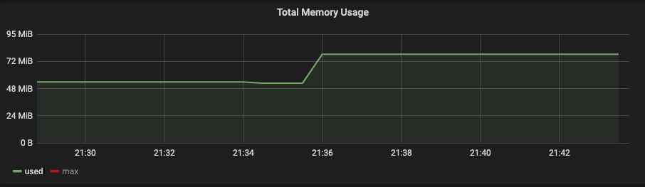
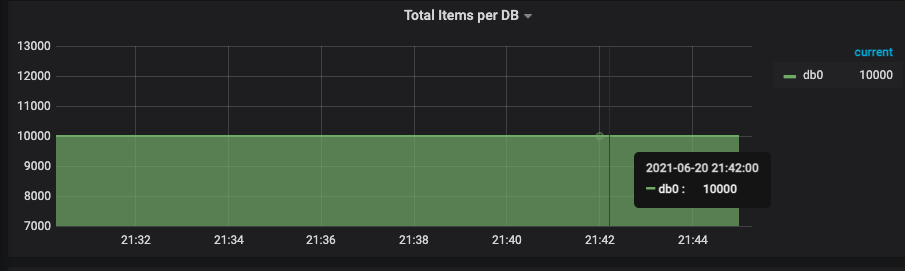

## 测试redis配置

```
daemonize yes
pidfile /var/run/redis.pid
port 6379
bind 10.210.100.214
timeout 2
loglevel verbose
databases 16
save 900 1
save 300 10
save 60 10000
dbfilename rdbfile.rdb
dir /data/cache/rdbfile
slave-serve-stale-data yes
repl-ping-slave-period 5
maxclients 1024000
maxmemory 8192000000
maxmemory-policy noeviction
appendonly yes
appendfilename appendonly.aof
slowlog-log-slower-than 10000
```

## 1、使用 redis benchmark 工具, 测试 10 20 50 100 200 1k 5k 字节 value 大小，redis get set 性能。

- 10字节

```
./redis-benchmark -h 10.210.100.214 -p 6379 -c 50 -n 100000  -d 10 -t get
====== GET ======
  100000 requests completed in 2.33 seconds
  50 parallel clients
  10 bytes payload
  keep alive: 1

75.79% <= 1 milliseconds
96.14% <= 2 milliseconds
98.57% <= 3 milliseconds
99.18% <= 4 milliseconds
99.40% <= 5 milliseconds
99.68% <= 6 milliseconds
99.89% <= 7 milliseconds
99.94% <= 8 milliseconds
99.99% <= 9 milliseconds
100.00% <= 9 milliseconds
42992.26 requests per second


 ./redis-benchmark -h 10.210.100.214 -p 6379 -c 50 -n 100000  -d 10 -t set
====== SET ======
  100000 requests completed in 2.60 seconds
  50 parallel clients
  10 bytes payload
  keep alive: 1

73.98% <= 1 milliseconds
95.89% <= 2 milliseconds
97.47% <= 3 milliseconds
98.24% <= 4 milliseconds
99.00% <= 5 milliseconds
99.32% <= 6 milliseconds
99.61% <= 7 milliseconds
99.80% <= 8 milliseconds
99.86% <= 9 milliseconds
99.94% <= 10 milliseconds
99.99% <= 11 milliseconds
100.00% <= 12 milliseconds
100.00% <= 12 milliseconds
38446.75 requests per second


```

- 20字节

```
./redis-benchmark -h 10.210.100.214 -p 6379 -c 50 -n 100000  -d 20 -t get
====== GET ======
  100000 requests completed in 2.31 seconds
  50 parallel clients
  20 bytes payload
  keep alive: 1

75.74% <= 1 milliseconds
97.07% <= 2 milliseconds
99.00% <= 3 milliseconds
99.40% <= 4 milliseconds
99.62% <= 5 milliseconds
99.73% <= 6 milliseconds
99.75% <= 7 milliseconds
99.90% <= 8 milliseconds
99.90% <= 9 milliseconds
99.92% <= 10 milliseconds
99.95% <= 11 milliseconds
100.00% <= 11 milliseconds
43252.59 requests per second


./redis-benchmark -h 10.210.100.214 -p 6379 -c 50 -n 100000  -d 20 -t set
====== SET ======
  100000 requests completed in 2.73 seconds
  50 parallel clients
  20 bytes payload
  keep alive: 1

67.45% <= 1 milliseconds
93.96% <= 2 milliseconds
97.30% <= 3 milliseconds
98.34% <= 4 milliseconds
98.61% <= 5 milliseconds
99.00% <= 6 milliseconds
99.40% <= 7 milliseconds
99.62% <= 8 milliseconds
99.78% <= 9 milliseconds
99.85% <= 10 milliseconds
99.86% <= 11 milliseconds
99.88% <= 12 milliseconds
99.98% <= 13 milliseconds
100.00% <= 14 milliseconds
100.00% <= 14 milliseconds
36589.83 requests per second
```

- 50字节

```
./redis-benchmark -h 10.210.100.214 -p 6379 -c 50 -n 100000  -d 50 -t get
====== GET ======
  100000 requests completed in 2.35 seconds
  50 parallel clients
  50 bytes payload
  keep alive: 1

76.02% <= 1 milliseconds
97.35% <= 2 milliseconds
98.54% <= 3 milliseconds
98.94% <= 4 milliseconds
99.12% <= 5 milliseconds
99.39% <= 6 milliseconds
99.51% <= 7 milliseconds
99.63% <= 8 milliseconds
99.77% <= 9 milliseconds
99.79% <= 10 milliseconds
99.85% <= 11 milliseconds
99.90% <= 12 milliseconds
99.90% <= 13 milliseconds
99.99% <= 14 milliseconds
100.00% <= 14 milliseconds
42517.01 requests per second

./redis-benchmark -h 10.210.100.214 -p 6379 -c 50 -n 100000  -d 50 -t set
====== SET ======
  100000 requests completed in 2.66 seconds
  50 parallel clients
  50 bytes payload
  keep alive: 1

67.90% <= 1 milliseconds
96.02% <= 2 milliseconds
97.89% <= 3 milliseconds
98.49% <= 4 milliseconds
98.90% <= 5 milliseconds
99.15% <= 6 milliseconds
99.36% <= 7 milliseconds
99.60% <= 8 milliseconds
99.74% <= 9 milliseconds
99.88% <= 10 milliseconds
99.94% <= 11 milliseconds
99.95% <= 21 milliseconds
99.99% <= 22 milliseconds
100.00% <= 22 milliseconds
37551.63 requests per second
```

- 100字节

```
./redis-benchmark -h 10.210.100.214 -p 6379 -c 50 -n 100000  -d 100 -t get
====== GET ======
  100000 requests completed in 2.14 seconds
  50 parallel clients
  100 bytes payload
  keep alive: 1

83.60% <= 1 milliseconds
96.78% <= 2 milliseconds
98.44% <= 3 milliseconds
99.06% <= 4 milliseconds
99.45% <= 5 milliseconds
99.71% <= 6 milliseconds
99.83% <= 7 milliseconds
99.85% <= 9 milliseconds
99.88% <= 10 milliseconds
100.00% <= 10 milliseconds
46794.57 requests per second


 ./redis-benchmark -h 10.210.100.214 -p 6379 -c 50 -n 100000  -d 100 -t set
====== SET ======
  100000 requests completed in 2.25 seconds
  50 parallel clients
  100 bytes payload
  keep alive: 1

78.59% <= 1 milliseconds
97.92% <= 2 milliseconds
99.28% <= 3 milliseconds
99.59% <= 4 milliseconds
99.73% <= 5 milliseconds
99.85% <= 6 milliseconds
99.88% <= 7 milliseconds
99.95% <= 8 milliseconds
99.95% <= 10 milliseconds
99.99% <= 11 milliseconds
100.00% <= 11 milliseconds
44483.99 requests per second
```

- 200 字节

```
./redis-benchmark -h 10.210.100.214 -p 6379 -c 50 -n 100000  -d 200 -t get
====== GET ======
  100000 requests completed in 2.14 seconds
  50 parallel clients
  200 bytes payload
  keep alive: 1

82.97% <= 1 milliseconds
97.84% <= 2 milliseconds
98.79% <= 3 milliseconds
99.08% <= 4 milliseconds
99.31% <= 5 milliseconds
99.39% <= 6 milliseconds
99.51% <= 7 milliseconds
99.78% <= 8 milliseconds
99.87% <= 9 milliseconds
99.95% <= 13 milliseconds
99.99% <= 14 milliseconds
100.00% <= 14 milliseconds
46772.68 requests per second

./redis-benchmark -h 10.210.100.214 -p 6379 -c 50 -n 100000  -d 200 -t set
====== SET ======
  100000 requests completed in 2.29 seconds
  50 parallel clients
  200 bytes payload
  keep alive: 1

76.51% <= 1 milliseconds
96.53% <= 2 milliseconds
98.27% <= 3 milliseconds
99.04% <= 4 milliseconds
99.29% <= 5 milliseconds
99.51% <= 6 milliseconds
99.71% <= 7 milliseconds
99.82% <= 8 milliseconds
99.94% <= 9 milliseconds
99.95% <= 15 milliseconds
99.99% <= 16 milliseconds
100.00% <= 16 milliseconds
43744.53 requests per second

```

- 1k

```
./redis-benchmark -h 10.210.100.214 -p 6379 -c 50 -n 100000  -d 1024 -t get
====== GET ======
  100000 requests completed in 2.59 seconds
  50 parallel clients
  1024 bytes payload
  keep alive: 1

70.58% <= 1 milliseconds
95.50% <= 2 milliseconds
98.05% <= 3 milliseconds
98.69% <= 4 milliseconds
99.03% <= 5 milliseconds
99.31% <= 6 milliseconds
99.68% <= 7 milliseconds
99.94% <= 8 milliseconds
99.97% <= 9 milliseconds
100.00% <= 9 milliseconds
38565.37 requests per second

 ./redis-benchmark -h 10.210.100.214 -p 6379 -c 50 -n 100000  -d 1024 -t set
====== SET ======
  100000 requests completed in 2.98 seconds
  50 parallel clients
  1024 bytes payload
  keep alive: 1

57.65% <= 1 milliseconds
91.65% <= 2 milliseconds
96.02% <= 3 milliseconds
97.55% <= 4 milliseconds
98.32% <= 5 milliseconds
98.76% <= 6 milliseconds
99.05% <= 7 milliseconds
99.15% <= 8 milliseconds
99.33% <= 9 milliseconds
99.57% <= 10 milliseconds
99.64% <= 11 milliseconds
99.67% <= 12 milliseconds
99.70% <= 13 milliseconds
99.81% <= 14 milliseconds
99.86% <= 15 milliseconds
99.87% <= 16 milliseconds
99.90% <= 17 milliseconds
99.92% <= 19 milliseconds
99.93% <= 20 milliseconds
99.98% <= 22 milliseconds
100.00% <= 22 milliseconds
33534.54 requests per second


```

- 5k

```
./redis-benchmark -h 10.210.100.214 -p 6379 -c 50 -n 100000  -d 5120 -t get
====== GET ======
  100000 requests completed in 2.48 seconds
  50 parallel clients
  5120 bytes payload
  keep alive: 1

73.12% <= 1 milliseconds
97.61% <= 2 milliseconds
98.78% <= 3 milliseconds
99.19% <= 4 milliseconds
99.47% <= 5 milliseconds
99.57% <= 6 milliseconds
99.71% <= 7 milliseconds
99.85% <= 8 milliseconds
99.93% <= 9 milliseconds
99.95% <= 13 milliseconds
100.00% <= 14 milliseconds
100.00% <= 14 milliseconds
40387.72 requests per second

./redis-benchmark -h 10.210.100.214 -p 6379 -c 50 -n 100000  -d 5120 -t set
====== SET ======
  100000 requests completed in 4.94 seconds
  50 parallel clients
  5120 bytes payload
  keep alive: 1

24.20% <= 1 milliseconds
76.15% <= 2 milliseconds
87.37% <= 3 milliseconds
90.68% <= 4 milliseconds
92.80% <= 5 milliseconds
94.48% <= 6 milliseconds
95.66% <= 7 milliseconds
96.53% <= 8 milliseconds
97.29% <= 9 milliseconds
97.84% <= 10 milliseconds
98.15% <= 11 milliseconds
98.46% <= 12 milliseconds
98.59% <= 13 milliseconds
98.78% <= 14 milliseconds
99.11% <= 15 milliseconds
99.29% <= 16 milliseconds
99.40% <= 17 milliseconds
99.43% <= 18 milliseconds
99.52% <= 19 milliseconds
99.59% <= 20 milliseconds
99.63% <= 21 milliseconds
99.70% <= 22 milliseconds
99.70% <= 23 milliseconds
99.70% <= 26 milliseconds
99.75% <= 28 milliseconds
99.79% <= 29 milliseconds
99.80% <= 30 milliseconds
99.81% <= 31 milliseconds
99.83% <= 32 milliseconds
99.85% <= 33 milliseconds
99.86% <= 34 milliseconds
99.87% <= 35 milliseconds
99.89% <= 36 milliseconds
99.90% <= 48 milliseconds
99.93% <= 49 milliseconds
99.95% <= 66 milliseconds
99.98% <= 67 milliseconds
100.00% <= 67 milliseconds
20230.63 requests per second
```


## 2、写入一定量的 kv 数据, 根据数据大小 1w-50w 自己评估, 结合写入前后的 info memory 信息  , 分析上述不同 value 大小下，平均每个 key 的占用内存空间。

- 代码，写入10000key
  
```
package main

import (
	"encoding/json"
	"fmt"
	_ "net/http/pprof"
	"time"

	"github.com/go-redis/redis"
)

var client *redis.Client

func init() {
	client = redis.NewClient(&redis.Options{
		Addr:     "10.210.100.214:6379",
		Password: "",
		DB:       0,
	})

	pong, err := client.Ping().Result()
	if err != nil {
		panic(err)
	}
	fmt.Println(pong)
}
func main() {
	start := time.Now()
	WriteRedis()
	fmt.Println("耗时: ", time.Since(start))
}

func WriteRedis() {
	max := 10000
	data := [1024]byte{}
	p := client.Pipeline()
	for i := 0; i < max; i++ {
		b, _ := json.Marshal(data)
		err := p.Set(fmt.Sprintf("key%v", i), b, time.Hour).Err()
		//fmt.Printf("status: %v\n", d)
		if err != nil {
			fmt.Printf("eroor:%v\n", err)
		}
	}
	x, e := p.Exec()
	if e != nil {
		fmt.Printf("error: %v \n", e)
	}
	fmt.Printf("result: %v \n", x)
}

```

- 内存增加（78M-52M=26M)/10000 = 等于每个key的大小 

- 内存增长图
  


- key数量图
  



```
info memory
# Memory
used_memory:81493272
used_memory_human:77.72M
used_memory_rss:64405504
used_memory_rss_human:61.42M
used_memory_peak:222555384
used_memory_peak_human:212.25M
used_memory_peak_perc:36.62%
used_memory_overhead:55728518
used_memory_startup:54776680
used_memory_dataset:25764754
used_memory_dataset_perc:96.44%
allocator_allocated:81714320
allocator_active:82026496
allocator_resident:84869120
total_system_memory:8348549120
total_system_memory_human:7.78G
used_memory_lua:37888
used_memory_lua_human:37.00K
used_memory_scripts:0
used_memory_scripts_human:0B
number_of_cached_scripts:0
maxmemory:8192000000
maxmemory_human:7.63G
maxmemory_policy:noeviction
allocator_frag_ratio:1.00
allocator_frag_bytes:312176
allocator_rss_ratio:1.03
allocator_rss_bytes:2842624
rss_overhead_ratio:0.76
rss_overhead_bytes:-20463616
mem_fragmentation_ratio:0.79
mem_fragmentation_bytes:-17025864
mem_not_counted_for_evict:0
mem_replication_backlog:0
mem_clients_slaves:0
mem_clients_normal:49694
mem_aof_buffer:0
mem_allocator:jemalloc-5.1.0
active_defrag_running:0
lazyfree_pending_objects:0
```